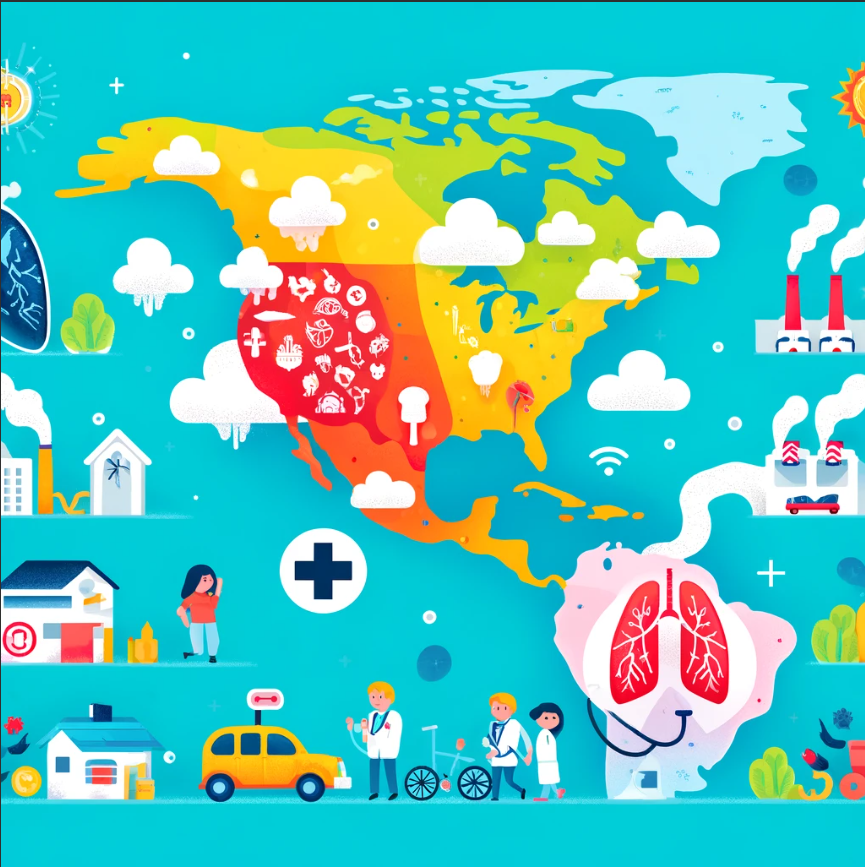

# Project Plan

## Title
Respiratory Health and Climate Quality in California

## Main Question
Is there a significant relationship between climate quality indicators (such as air pollution levels) and respiratory health outcomes across different regions in California?

## Description
This project investigates the correlation between climate quality factors specifically air pollution and respiratory health outcomes in California. By examining data on air quality and respiratory illness rates, we are determining if poor climate quality is a substantial contributor to respiratory health issues and also identifying which regions within California are most affected.

## Data Sources

### Data Source 1: Climate Quality Data
- **Metadata URL:** [Kaggle - California Air Quality 2020 Through September](https://www.kaggle.com/datasets/thaddeussegura/california-air-quality-2020-through-sept10th)
- **Data URL:** [California Air Quality Data](https://www.kaggle.com/datasets/thaddeussegura/california-air-quality-2020-through-sept10th)
- **Data Type:** CSV
- **Description:** This dataset provides daily air quality measurements for pollutants such as PM2.5, ozone, and NO2 in California for 2020. It includes data at the county level, enabling analysis of pollution trends and patterns across different regions.

### Data Source 1: Climate Quality Data
- **Metadata URL:** [Kaggle - California Air Quality 2020 Through September](https://www.kaggle.com/datasets/thaddeussegura/california-air-quality-2020-through-sept10th)
- **Data URL:** [California Air Quality Data](https://www.kaggle.com/datasets/thaddeussegura/california-air-quality-2020-through-sept10th)
- **Data Type:** CSV
- **Description:** This dataset provides daily air quality measurements for pollutants such as PM2.5, ozone, and NO2 in California for 2020. It includes data at the county level, enabling analysis of pollution trends and patterns across different regions.

### Data Source 2: Respiratory Health Data
- **Metadata URL:** [California Health and Human Services - Respiratory Virus Dashboard Metrics](https://data.chhs.ca.gov/dataset/respiratory-virus-dashboard-metrics)
- **Data URL:** [CHHS Respiratory Health Metrics](https://data.chhs.ca.gov/dataset/respiratory-virus-dashboard-metrics)
- **Data Type:** CSV
- **Description:** This dataset includes metrics on respiratory health outcomes such as case counts, hospitalizations, and ICU admissions for respiratory viruses. It allows for tracking respiratory health trends over time and analyzing potential correlations with air pollution levels in different regions.

## Work Packages

1. **Data Collection and Preprocessing**
   - Collect and clean data on air quality and respiratory health metrics across California.
   - Standardize formats and ensure data alignment by date and region (e.g., county level).

2. **Exploratory Data Analysis**
   - Analyze the air quality data to identify patterns of high pollution periods.
   - Examine respiratory health trends over time, noting any seasonal peaks or unusual spikes.

3. **Correlation Analysis**
   - Perform statistical analyses to assess correlations between air quality metrics (e.g., PM2.5, ozone) and respiratory health outcomes.
   - Consider time-lagged correlations to examine if pollution exposure has delayed effects on respiratory health.

4. **Report and Visualization**
   - Create visualizations to highlight trends and correlations between pollution levels and respiratory health incidents.
   - Develop a final report detailing findings, including which pollutants and regions show the strongest relationship with respiratory health issues.
