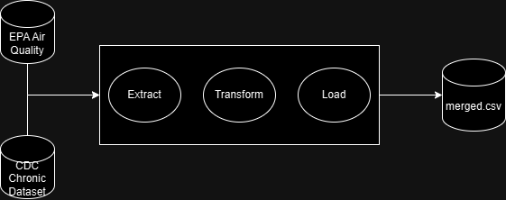

# Project Plan

## Title
Respiratory Health and Climate Quality in California

## Main Question
Is there a significant relationship between climate quality indicators (such as air pollution levels) and respiratory health outcomes across different regions in California?

## Description
This project investigates the correlation between climate quality factors, specifically air pollution, and respiratory health outcomes in California. By examining data on air quality and respiratory illness rates, we aim to determine if poor climate quality is a substantial contributor to respiratory health issues and identify which regions within California are most affected.

## Data Sources

### Data Source 1: Air Quality Data
- **Data URL:** [EPA Air Quality System (AQS)](https://aqs.epa.gov/aqsweb/documents/data_api.html)
- **Data Type:** CSV
- **Description:** This dataset provides daily air quality measurements for pollutants such as PM2.5, ozone, and NO2 in California. It includes data at the county level, enabling analysis of pollution trends and patterns across different regions.
- **Structure and Quality:**
  - Tabular data with attributes such as “state_code”, “date_local”, and “sample_measurement”.
  - Missing values handled during preprocessing.
- **License:** [Open access by the EPA with attribution requirements](https://data.gov/open-gov/).

### Data Source 2: Respiratory Health Data
- **Data URL:** [CDC Chronic Disease Indicators Dataset](https://data.cdc.gov/Chronic-Disease-Indicators/U-S-Chronic-Disease-Indicators/hksd-2xuw)
- **Data Type:** CSV
- **Description:** This dataset includes metrics on respiratory health outcomes such as case counts, hospitalizations, and ICU admissions for respiratory viruses. It allows tracking respiratory health trends over time and analyzing potential correlations with air pollution levels in different regions.
- **Structure and Quality:**
  - Tabular data with fields such as “topic”, “state_code”, and “respiratory_value”.
  - Data preprocessing to filter relevant health indicators.
- **License:** [Open Data Commons License (ODC-ODbL)](https://opendatacommons.org/licenses/odbl/1-0/).

## Work Packages

1. **Data Collection and Preprocessing**
   - Extract and clean data from EPA and CDC sources.
   - Standardize data formats and align them by date and region (county-level granularity).

2. **Exploratory Data Analysis**
   - Identify patterns in PM2.5 levels and respiratory health metrics.
   - Analyze distributions and seasonal variations to uncover anomalies or trends.

3. **Statistical Analysis**
   - Conduct correlation analysis to assess relationships between pollutants and respiratory metrics.
   - Implement regression models to explore predictive relationships.

4. **Visualization and Reporting**
   - Create visualizations for state-level, temporal, and distributional analyses.
   - Develop a comprehensive report summarizing key findings and recommendations.

## Methodology Highlights

### Pipeline Overview

\`\`\`
Extract -> Transform -> Load
\`\`\`

- The project employs a modular architecture to ensure clarity and reproducibility.
- **Multithreading**: Enabled efficient preprocessing by parallelizing data cleaning and transformation tasks.
- **Code Organization**:
  - “extract.py” handles data extraction from APIs and files.
  - “transform.py” manages data cleaning and standardization.
  - “load.py” saves cleaned data for analysis.

This structure follows best practices, segregating responsibilities and improving maintainability.
